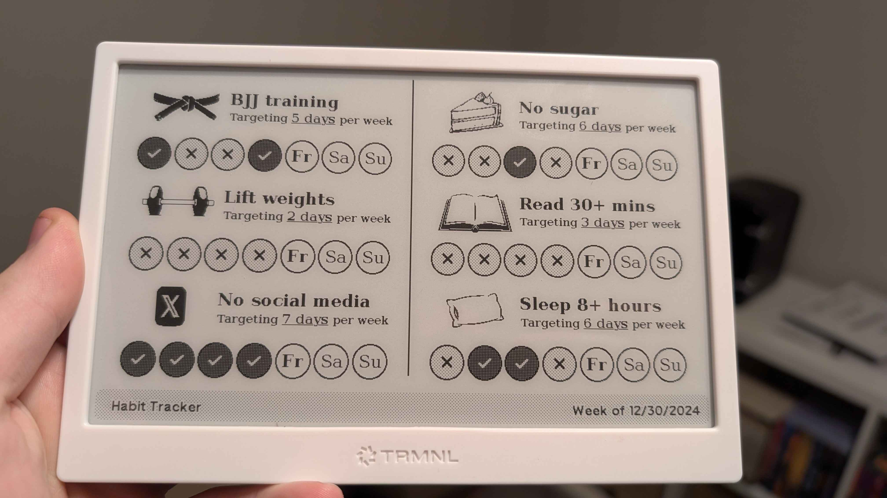
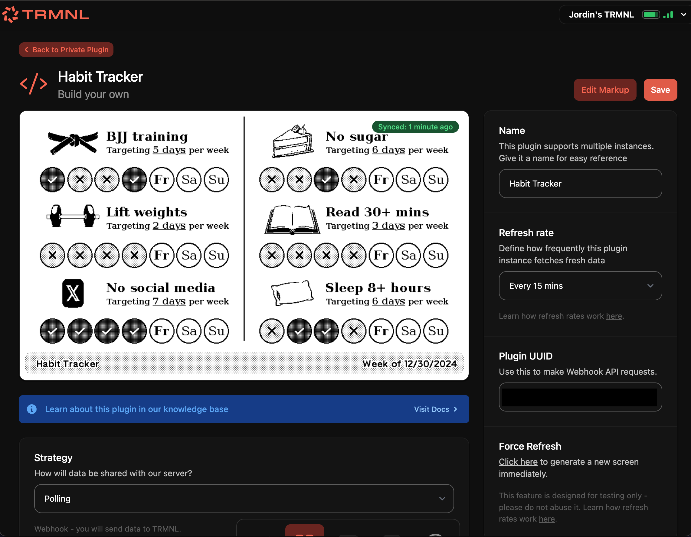

# Weekly Goal Tracker

Track weekly goals through a simple web interface. Keep your goals top of mind via a cool e-ink display which you never (ish) need to charge. Goal tracking automatically resets each week.



https://github.com/user-attachments/assets/fa169322-b3d4-408d-8c9f-74112ea4c89d

This was specifically developed to back a private plugin created for my [trmnl](https://usetrmnl.com/) device. I'd love to make a public version of this plugin, but I don't currently foresee a low friction path to making it free + easy for other people to tap into this without me incurring compute costs over time.

## Development

You'll need git and a recent version of Node.js installed on your system.

1. Clone this repository
2. Run `npm install` from the root to install dependencies
3. Run `npm run dev` from the root to run the web app locally

You'll need an `.env` file in the root of the repository that looks like this:

```sh
# connection string for a Postgres database
POSTGRES_URL=postgres://{user}:{password}@{host}
# token which can be used for reading and writing to/from Vercel blob storage -- image uploads won't
# work without this
BLOB_READ_WRITE_TOKEN="vercel_blob_rw_xxxxxxxxxxxx"
# optional: if specified, the web app will only load with `?ip={INSTANCE_PASSWORD}`, and the API
# will only respond to requests with a header like `x-instance-password={INSTANCE_PASSWORD}
INSTANCE_PASSWORD=xxxx-xxxx-xxxx-xxxx
```

## Deployment
I'm happy to write up a detailed guide for this upon request, but for now, I've written up some fairly high level instructions. It should be tenable for anyone to deploy their own instance, but be ready for quite a few steps.

I built this with Next.js so that I could easily take advantage of the hosted infra you can get through Vercel's fairly generous free tier. Unfortunately, that means that some of this code (probably) suffers from vendor lock-in, and you'll (probably) also have to deploy to Vercel unless you fork the code.

### Backend

1. Clone this repo
2. Install the Vercel CLI and authenticate
3. Create a new Vercel project (CLI can be used for this)
4. Create a hosted Postgres database. I used [Neon](https://vercel.com/marketplace/neon) since it has a decent free tier, but you could use something else to your preference.
5. Create a [Vercel Blob](https://vercel.com/docs/storage/vercel-blob) instance in your project
6. Generate a random string which will be used to password-protect your instance (e.g. use a password manager)
7. Appropriately configure the environment variables shown in the `.env` file above for your Vercel project

### Trmnl Plugin

1. Create a new private plugin
2. Set Strategy to "Polling"
3. Set Polling URL to "{VERCEL_BASE_URL}/api/trmnl"
4. In Polling Headers, add "x-instance-password=xxxx-xxxx-xxxx-xxxx"
5. Set Remove Bleed Margin? to "No"
6. Copy and paste the contents of [template.html](template.html) in your private plugin's template

### Testing

1. Navigate to the URL of your app with `?ip={INSTANCE_PASSWORD}` as the query string -- the page should load
2. Create up to 6 weekly habits; ensure you click "Save Changes" for each once configuration is done
3. On the page of your private plugin, follow instructions for forcing a refresh


